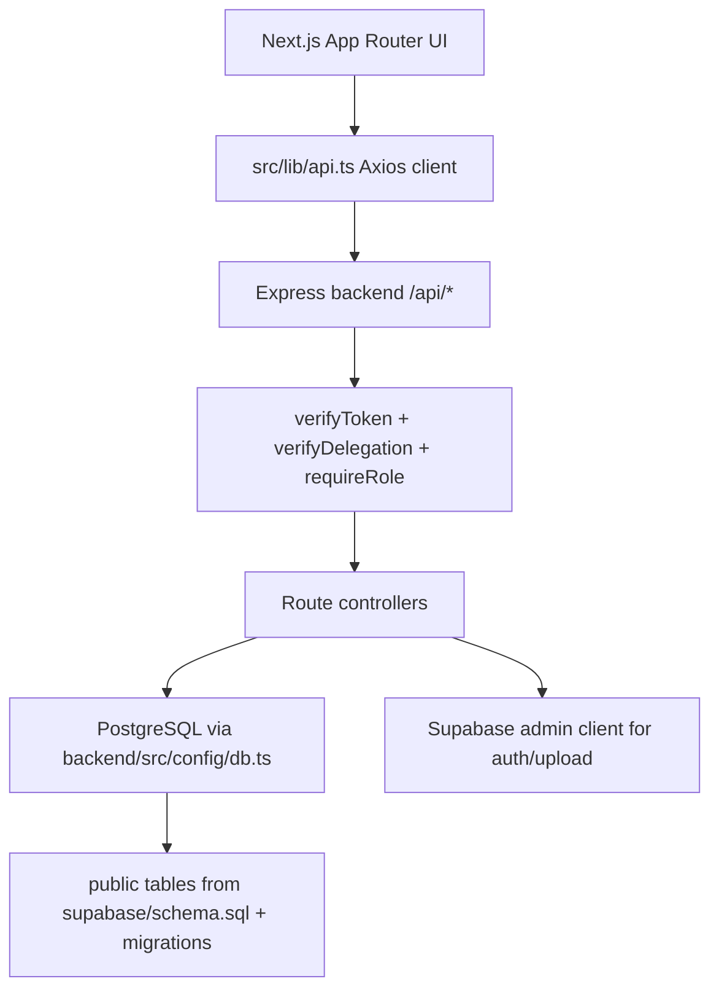
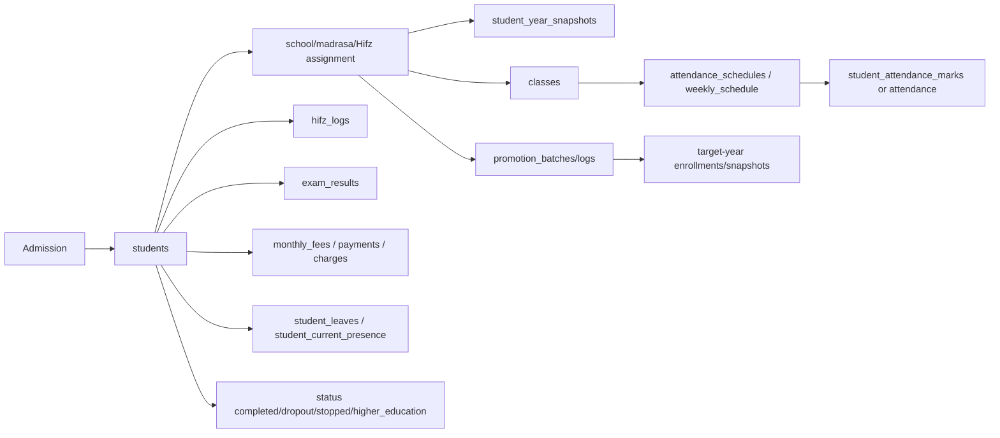
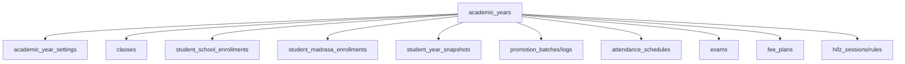
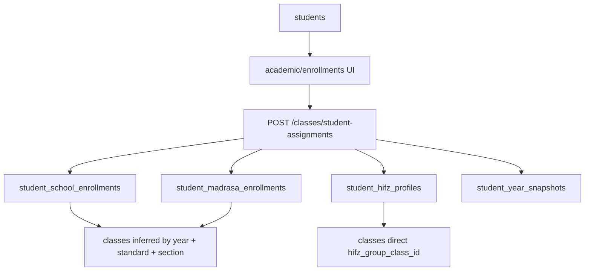
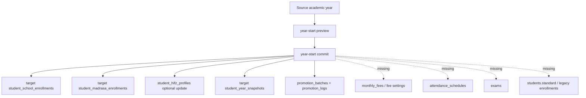
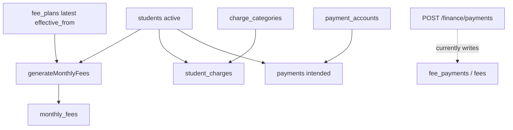
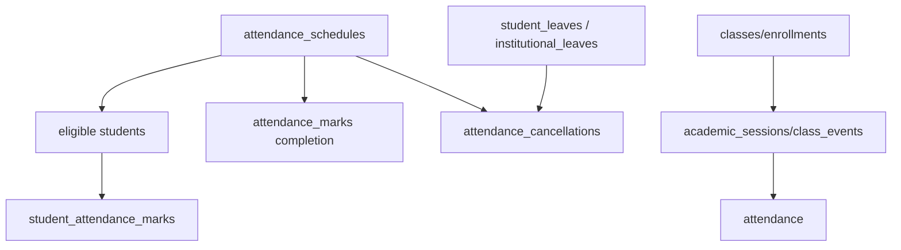
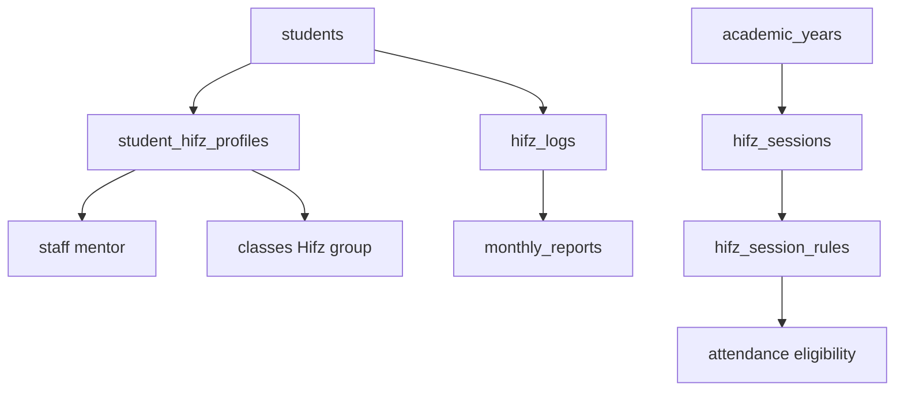
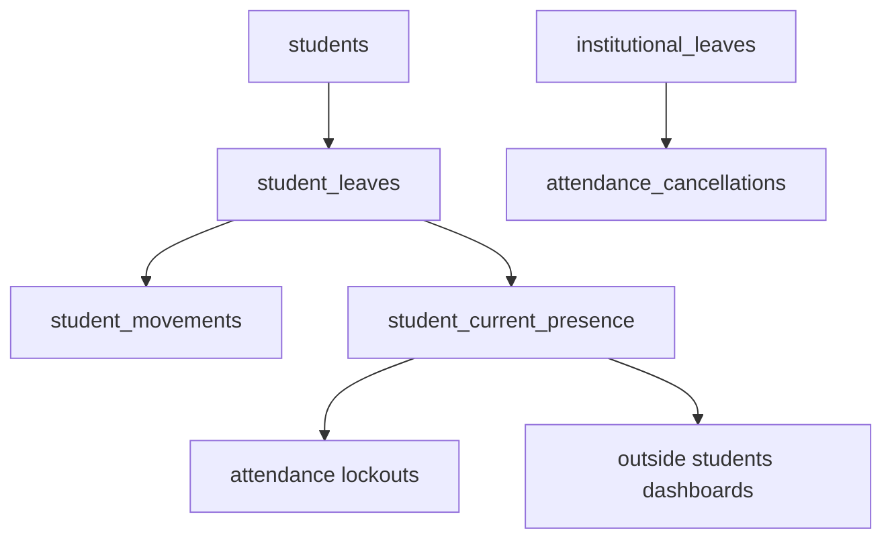

# Feature Dependency, Workflow, and Data Relationship Audit

Audit date: 2026-06-04  
Project root: `D:\NewRQP`

## Executive Summary

This project is a Next.js + Express + PostgreSQL/Supabase institutional ERP. The implemented domains are students, staff, academic years, classes, enrollments, promotions, attendance, Hifz progress, Hifz session rules, exams, fees, leaves, reports, chat, delegations, parent portal, and principal/staff/admin portals.

The most important architectural finding is that the project is mid-transition from a legacy "student carries the current class on `students.standard`" model to a year-aware academic history model using `academic_years`, `classes`, `student_school_enrollments`, `student_madrasa_enrollments`, `student_hifz_profiles`, `student_year_snapshots`, and promotion tables. Some modules use the new model, but many production workflows still read or write the old fields. This creates silent data divergence after promotion.

Critical risks:

1. Promotions do not update several operational modules that still depend on legacy student fields.
2. Finance payment routes are split between old tables (`fees`, `fee_payments`) and current tables (`monthly_fees`, `payments`, `student_charges`).
3. Attendance has two parallel systems: legacy `attendance`/`academic_sessions`/`class_events` and newer `attendance_schedules`/`student_attendance_marks`/`attendance_marks`.
4. Exams gained `academic_year_id` in migrations, but controller code does not create or filter exams by academic year.
5. Several frontend API calls do not match declared backend routes.
6. Some operational tables are referenced by code and indexes, but their create migrations are not present in the current migration folder, suggesting schema drift.

## System Architecture Map



Major source locations:

- Frontend app pages: `src/app`
- Shared frontend components: `src/components`
- API client: `src/lib/api.ts`
- Backend entrypoint: `backend/src/index.ts`
- Backend routes: `backend/src/routes`
- Backend controllers: `backend/src/controllers`
- Academic-year helpers: `backend/src/utils/academic-year.ts`
- Attendance report helper: `backend/src/utils/attendance-report.ts`
- Database baseline and migrations: `supabase/schema.sql`, `supabase/migrations`

## Database Relationship Map

### Core Identity

`profiles`

- Purpose: application user profile tied to Supabase auth.
- Parent: `auth.users`.
- Children: `staff.profile_id`, `attendance.recorded_by`.
- Risks: Express backend bypasses RLS, so route middleware is the real authorization boundary.

`staff`

- Purpose: employees, mentors, admins, principals, controllers.
- Parent: optional `profiles`.
- Children: student mentor columns, Hifz logs, leaves, attendance schedules, class schedules, delegations, chat, promotion settings.
- Important columns: `role`, `profile_id`, `is_active`, `is_exam_controller`, `phone`.
- Risk: role naming is inconsistent across migrations and code: `staff`, `usthad`, `teacher`, `mentor` appear in different places.

`students`

- Purpose: master student record.
- Children: almost every domain table.
- Important columns: `adm_no`, `status`, `standard`, `hifz_standard`, `school_standard`, `madrassa_standard`, `hifz_mentor_id`, `school_mentor_id`, `madrasa_mentor_id`, `custom_monthly_fee`, `comprehensive_details`.
- Risk: still acts as both master identity and current academic placement. New year-aware placement exists elsewhere, causing duplication.

### Academic Year and Class History

`academic_years`

- Purpose: academic year master.
- Children: `classes`, legacy `enrollments`, `academic_year_settings`, `student_school_enrollments`, `student_madrasa_enrollments`, `student_year_snapshots`, promotions, Hifz sessions, fee plans, exams.
- Important columns: `is_current`, `is_locked`, `promotion_window_open`.
- Risk: `upsertAcademicYear` allows multiple `is_current=true` rows unless constrained elsewhere.

`academic_year_settings`

- Purpose: year-level settings, lock state, fee-plan links, promotion completion.
- Parents: `academic_years`, optional `fee_plans`.
- Used by: `academic_history.controller.ts`.
- Risk: finance controllers do not use the fee-plan links.

`classes`

- Purpose: year-specific class/group setup for School, Madrassa, Hifz.
- Parent: `academic_years`.
- Children: legacy `enrollments`, `weekly_schedule`, `class_events`, `student_hifz_profiles.hifz_group_class_id`, `attendance_schedules.class_id`.
- Current behavior: deleting a class archives it (`is_archived=true`) in `classes.controller.ts`.
- Risk: class membership is not represented by a direct class ID in the new school/madrasa enrollment tables; it is inferred by year + standard + section.

`enrollments`

- Purpose: original class membership table.
- Parents: `students`, `classes`, `academic_years`.
- Current usage: still used by legacy setup pages under `src/app/admin/setup/classes/[classId]/students/page.tsx`.
- Risk: newer enrollment UI uses `student_school_enrollments`, `student_madrasa_enrollments`, and `student_hifz_profiles`, not this table.

`student_school_enrollments`

- Purpose: year-aware school placement.
- Parents: `students`, `academic_years`.
- Unique: `(student_id, academic_year_id)`.
- Used by: promotion commit, class student list, class assignment UI.
- Missing link: no direct `class_id`; class is inferred by matching `academic_year_id`, `school_standard`, `school_section`.

`student_madrasa_enrollments`

- Purpose: year-aware madrasa placement.
- Same pattern and risks as school enrollments.

`student_hifz_profiles`

- Purpose: current Hifz profile, mentor, active flag, Hifz group.
- Parent: `students`, optional `staff`, optional `classes`.
- Risk: not year-versioned except via snapshots; Hifz mentor/group changes overwrite current profile.

`student_year_snapshots`

- Purpose: denormalized per-student, per-year lookup used by students and reports.
- Parents: `students`, `academic_years`, `staff`, Hifz class.
- Used by: `getAllStudents`, `getStudentById`, some reports, promotion commit.
- Risk: not all modules apply snapshots.

### Promotions

`promotion_previews`

- Purpose: persisted draft/confirmed promotion previews.
- Current code: preview endpoint builds an in-memory preview and does not insert into this table.
- Risk: table exists but workflow does not use it as an auditable preview artifact.

`promotion_batches`

- Purpose: committed promotion batch.
- Parents: source and target `academic_years`, optional `promotion_previews`.
- Used by: `commitYearStart`.

`promotion_logs`

- Purpose: per-student promotion trail for school/madrasa.
- Parents: `promotion_batches`, `students`.
- Missing: no Hifz promotion log track because check allows only `school`, `madrasa`.

### Attendance

`academic_sessions`

- Purpose: legacy session setup.
- Children: legacy `attendance.session_id`.
- Used by: `academics.controller.ts` and older attendance/profile pages.

`attendance`

- Purpose: legacy attendance marks.
- Parents: `students`, `academic_sessions`, `class_events`, `profiles`.
- Used by: department attendance page under `src/app/admin/[department]/attendance/page.tsx`.
- Risk: constraint history is confused. Migrations added `UNIQUE(student_id,date)` and later `UNIQUE(student_id,class_event_id)`, while `upsertAttendance` still uses conflict `(student_id, date, session_id)`.

`attendance_schedules`

- Purpose: newer recurring attendance schedule.
- Parents: optional `academic_years`, optional `classes`, optional mentor/staff.
- Used by: admin timetable, staff attendance, department attendance, reports.
- Risk: referenced throughout code and indexed by migrations, but no create-table migration is present in the visible migration set.

`student_attendance_marks`

- Purpose: per-student schedule/date attendance marks.
- Parents should be: `attendance_schedules`, `students`, `staff`.
- Used by: `attendance_dashboard.controller.ts`, reports, Hifz monthly report calculations.
- Risk: referenced and indexed, but create-table migration is not visible.

`attendance_marks`

- Purpose: per-schedule/date/mentor completion marker.
- Unique: migrated to `(schedule_id, date, marked_by)`.
- Used by: attendance dashboard and mentor reports.

`attendance_cancellations`

- Purpose: schedule/date cancellation, including partial standard cancellation.
- Used by: attendance dashboard, institutional leave cancellation, reports.

`staff_attendance`

- Purpose: auto shadow-mark mentor staff present when marking class attendance.
- Used by: daily stats.

### Hifz

`hifz_logs`

- Purpose: daily Hifz progress log.
- Parents: `students`, `staff`.
- Used by: staff daily entry, admin Hifz tracking, reports, parent dashboard.
- Risk: no `academic_year_id`; historical progress is date-based only.

`monthly_reports`

- Purpose: Hifz monthly report aggregates.
- Parent: `students`.
- Used by: parent dashboard, Hifz reports.
- Risk: no `academic_year_id`; old monthly report rows are not transferred during promotion.

`hifz_monthly_report_settings`

- Purpose: report-month settings.
- Risk: not tied to academic year.

`hifz_sessions`

- Purpose: named Hifz attendance sessions per academic year.
- Parent: `academic_years`.

`hifz_session_rules`

- Purpose: define which standard/section/mentor can attend a Hifz session in a year.
- Parents: `academic_years`, `hifz_sessions`, optional `staff`.

`student_hifz_session_assignments`

- Purpose: explicit student to Hifz session assignment.
- Parents: `academic_years`, `students`, `hifz_sessions`.

### Finance

`fee_plans`

- Purpose: fee plan amount/effective date.
- New column: `academic_year_id`.
- Used by: `getFeePlans`, `generateMonthlyFees`, settings.
- Risk: `generateMonthlyFees` selects latest plan by `effective_from`, not by academic year or department.

`monthly_fees`

- Purpose: generated monthly student fee rows.
- Parent: `students`.
- Unique: `(student_id, month)`.
- Risk: no `academic_year_id`; month is the only year separator.

`student_charges`

- Purpose: extra charges linked to categories.
- Parents: `students`, `charge_categories`.

`payments`

- Purpose: actual payment records in active schema.
- Parents: `students`, optional `payment_accounts`.

`payment_accounts`

- Purpose: cash/UPI/bank collection accounts.

`charge_categories`

- Purpose: fee charge category master.

Deprecated/old finance names:

- `fees` and `fee_payments` are referenced by `finance.controller.ts` but are not created by current finance migrations.
- `store_wallet`, `store_transactions`, `finance_settings`, and legacy `leaves` were renamed to deprecated tables in security hardening migrations.

### Exams

`exams`

- Purpose: exam master.
- New column: `academic_year_id`.
- Used by: exam pages and reports.
- Risk: controller does not insert or filter by `academic_year_id`.

`exam_subjects`

- Purpose: exam subject rows.
- Parent: `exams`.
- Uses optional `standard`.

`exam_results`

- Purpose: marks per student/subject/exam.
- Parents: `exams`, `exam_subjects`, `students`.

### Leaves and Presence

`student_leaves`

- Purpose: personal/group/out-campus/on-campus/outdoor leave lifecycle.
- Parent: `students`.
- Used by: admin/staff/parent leaves, attendance lockouts, outside students dashboards.

`student_movements`

- Purpose: out/in movement audit trail linked to leave.
- Parents: `students`, `student_leaves`.

`institutional_leaves`

- Purpose: institutional events that can cancel attendance sessions.
- Risk: code references this table, but visible migrations include indexes/references, not create-table definition.

`student_current_presence`

- Purpose: fast current outside/on-campus status.
- Parents: `students`, optional active `student_leaves`.

### Reports and Summaries

`student_report_summary`, `daily_attendance_summary`, `leave_dashboard_summary`

- Purpose: precomputed or cached reporting summaries.
- Current risk: not clearly populated by active workflows.

## Feature Relationship Audit

### Student

Purpose: master entity for every operational module.

Tables used:

- `students`
- `student_year_snapshots`
- `student_school_enrollments`
- `student_madrasa_enrollments`
- `student_hifz_profiles`
- Hifz, attendance, fee, exam, leave, report child tables.

APIs:

- `/api/students`
- `/api/students/:id`
- `/api/students/next-id`
- `/api/students/counts`
- `/api/students/download-excel`
- `/api/students/disciplinary`

Frontend:

- `src/app/admin/students/page.tsx`
- `src/app/admin/students/create/page.tsx`
- `src/app/admin/students/[id]/page.tsx`
- `src/app/principal/students/page.tsx`
- `src/app/staff/student/[id]/page.tsx`
- `src/app/parent/page.tsx`

Dependency chain:

```text
students
-> academic year snapshots/enrollments
-> class setup
-> attendance schedules and marks
-> Hifz logs and reports
-> exam results
-> monthly fees/payments/charges
-> leaves and current presence
-> reports/parent/principal/staff views
-> alumni/status lifecycle
```

Data-change impact:

- Changing `students.status` hides the student from active lists, attendance, leaves, finance active-student selectors, and parent login.
- Changing `students.standard` affects legacy attendance, staff dashboards, reports, leaves grouping, exams, parent views, and finance selectors.
- Changing mentor columns affects staff portals, attendance permissions, Hifz reports, delegation calculations, and mentor reports.
- Changing `students.status` to alumni-like states is guarded by active leave checks in `students.controller.ts`.

Missing connections:

- Student creation writes `students` only; it does not create initial school/madrasa enrollments or year snapshot.
- Student update can change `standard` and mentor fields without synchronizing the current year's `student_year_snapshots` or enrollment history.

### Academic Year

Purpose: year boundary for classes, enrollment history, promotions, timetable, exams, fee plans, snapshots.

Tables:

- `academic_years`
- `academic_year_settings`
- `classes`
- `student_school_enrollments`
- `student_madrasa_enrollments`
- `student_year_snapshots`
- `promotion_batches`
- `promotion_logs`
- `fee_plans.academic_year_id`
- `exams.academic_year_id`
- `attendance_schedules.academic_year_id`
- `hifz_sessions.academic_year_id`
- `hifz_session_rules.academic_year_id`

APIs:

- `/api/classes/academic-years`
- `/api/academic-history/years`
- `/api/academic-history/current`
- `/api/academic-history/health`
- `/api/academic-history/settings`
- `/api/academic-history/year-start/preview`
- `/api/academic-history/year-start/commit`

Frontend:

- `src/app/admin/setup/academic-years/page.tsx`
- `src/app/admin/academic-history/page.tsx`
- `src/app/admin/promotions/page.tsx`
- `src/app/admin/academic/class-setup/page.tsx`
- `src/app/admin/academic/enrollments/page.tsx`
- `src/app/admin/timetable/setup/page.tsx`
- `src/app/admin/academic/hifz-session-rules/page.tsx`

Workflow:

```text
Academic year created
-> classes can be created for that year
-> enrollments/snapshots can be populated
-> timetable schedules can be attached
-> fee plans/exams can be tagged
-> promotions can target that year
```

What happens when a year is created:

- `classes.controller.ts` inserts `academic_years`.
- No automatic `academic_year_settings` row is created.
- No classes, fee plans, exams, snapshots, enrollments, or schedules are created.

What happens when a year is changed:

- Name/date/current/lock/promotion flag can be updated.
- There is no explicit single-current-year enforcement in the controller.
- Lock protection exists at database trigger level for many year-aware tables.

What happens when a year is closed/locked:

- Code exposes `is_locked` and `academic_year_settings.year_locked`.
- Database trigger blocks mutation of many year-linked tables if the settings lock is true.
- There is no dedicated close-year workflow that validates reports, fees, attendance, exams, and promotions before locking.

What happens when a year is deleted:

- `/api/classes/academic-years/:id` deletes from `academic_years`.
- Because new history tables use `ON DELETE RESTRICT`, deletion should fail if referenced.
- Legacy `classes` used `ON DELETE CASCADE`; deleting an unreferenced year could delete classes.

Data that should transfer between years:

- School placement: from `student_school_enrollments` to target year.
- Madrasa placement: from `student_madrasa_enrollments` to target year.
- Hifz mentor/group current state: to `student_hifz_profiles` or target snapshots.
- Student snapshot: target `student_year_snapshots`.
- Fee configuration: year-level `academic_year_settings` and/or `fee_plans.academic_year_id`.
- Timetable template: target `attendance_schedules` should be copied or recreated.
- Exams: new year exam structures may need cloning but not old marks.
- Reports: historical reports should remain date/year scoped, not copied.

Data currently not transferred by promotion:

- `attendance_schedules`
- `attendance_marks`
- `student_attendance_marks`
- legacy `attendance`
- `hifz_logs`
- `monthly_reports`
- `monthly_fees`
- `payments`
- `student_charges`
- `student_leaves`
- `student_current_presence`
- `exams` / `exam_subjects`
- legacy `enrollments`
- legacy `students.standard`, `students.school_standard`, `students.madrassa_standard`

### Academic Class

Purpose: year-specific class or group definitions.

Tables:

- `classes`
- `student_school_enrollments`
- `student_madrasa_enrollments`
- `student_hifz_profiles`
- legacy `enrollments`
- `weekly_schedule`
- `class_events`
- `attendance_schedules`

APIs:

- `/api/classes`
- `/api/classes/:id/students`
- `/api/classes/student-assignments`
- `/api/classes/enrollments`
- `/api/classes/schedule`
- `/api/classes/events`

Class creation:

- `upsertClass` inserts `classes` with `academic_year_id`, `type`, `standard`, `section`, `name`.
- Deletion archives class, preserving history.

Student assignment:

- New UI: `/api/classes/student-assignments` writes `student_school_enrollments`, `student_madrasa_enrollments`, `student_hifz_profiles`, and `student_year_snapshots`.
- Legacy UI: `/api/classes/enrollments` writes `enrollments`.

Connections:

- School/Madrassa class membership is inferred from standard/section.
- Hifz class membership is direct through `student_hifz_profiles.hifz_group_class_id`.
- Attendance schedules can link to a class through `attendance_schedules.class_id`.
- Weekly schedules and class events still use `classes` + `weekly_schedule` + `class_events`.

Broken or missing relationships:

- `student_school_enrollments` and `student_madrasa_enrollments` do not have `class_id`, so renaming/changing class standard/section can detach students from class lookup.
- Legacy `enrollments` is not synchronized with the new assignment flow.
- Attendance schedules are not automatically generated from classes.

### Academic Enrollment

There are two enrollment models.

Legacy enrollment:

```text
students -> enrollments -> classes -> academic_years
```

APIs:

- `/api/classes/enrollments`
- `getEnrollments`
- `enrollStudent`
- `deleteEnrollment`

New assignment/history enrollment:

```text
students
-> student_school_enrollments / student_madrasa_enrollments
-> student_year_snapshots
-> classes inferred by year + standard + section
```

APIs:

- `/api/classes/student-assignments`
- `/api/classes/:id/students`

Complete current workflow:

1. Admin opens `src/app/admin/academic/enrollments/page.tsx`.
2. Page loads `/classes/academic-years`, `/classes`, `/classes/student-assignments`.
3. Admin selects school, madrasa, and Hifz class.
4. Frontend posts `/classes/student-assignments`.
5. Backend validates selected class types.
6. Backend upserts school/madrasa enrollment rows.
7. Backend upserts Hifz profile if Hifz class is selected.
8. Backend upserts a target year snapshot.

When enrollment is updated:

- School/madrasa rows for that student/year are overwritten.
- Snapshot is partially merged by `COALESCE`.
- Old enrollment history status is not changed to inactive.

When enrollment is deleted:

- Only legacy `/classes/enrollments/:id` delete exists.
- There is no API to remove new school/madrasa assignment or Hifz profile assignment.

Missing workflow connections:

- New assignments do not update `students.standard` or department standard fields.
- New assignments do not create legacy `enrollments`.
- Legacy enrollment APIs do not update snapshots.
- No validation prevents assigning the same student to an archived class.

### Academic Promotions

Main UI: `src/app/admin/promotions/page.tsx`  
Main controller: `backend/src/controllers/academic_history.controller.ts`

Promotion workflow:

```text
UI loads academic years
-> UI selects source year and target year
-> UI builds rules/exclusions
-> POST /academic-history/year-start/preview
-> backend reads source school/madrasa enrollment history and Hifz profiles
-> backend returns proposed target standards/sections/groups
-> POST /academic-history/year-start/commit
-> backend transaction creates promotion_batches
-> backend upserts target school/madrasa enrollments
-> backend writes promotion_logs
-> backend optionally updates student_hifz_profiles
-> backend upserts student_year_snapshots
-> backend writes academic_year_migration_reports
-> backend marks academic_year_settings.promotion_completed = true
```

Current Class -> New Class:

- School/Madrassa: source class is inferred from enrollment standard/section; target class is also inferred.
- Hifz: current group can be carried or overwritten in `student_hifz_profiles.hifz_group_class_id`.
- Missing: no validation guarantees target class rows exist for every target standard/section.

Current Academic Year -> New Academic Year:

- Source and target are required and must differ.
- Target lock is checked.
- Missing: source year is not locked after promotion.

Current Enrollment -> New Enrollment:

- School and madrasa history rows are created/updated for target year.
- Missing: legacy `enrollments` is not updated.
- Missing: previous year enrollment status remains active; this is acceptable for history, but current/active semantics need clear interpretation.

Current Fee Setup -> New Fee Setup:

- Not handled by promotion.
- `academic_year_settings` can store fee plan IDs, but promotion does not set them.
- Monthly fees are not generated or updated.

Current Hostel Assignment -> New Hostel Assignment:

- No hostel module or hostel tables were found in source/migrations.
- Equivalent presence/leave state remains untouched.

Current Reports -> New Reports:

- Snapshots enable some student/report views by year.
- Existing reports, monthly reports, Hifz logs, attendance marks are not copied.
- This is mostly correct for historical facts, but reports must filter by dates/year consistently.

Tables updated by promotion:

- `promotion_batches`
- `promotion_logs`
- `student_school_enrollments`
- `student_madrasa_enrollments`
- `student_hifz_profiles` only when carry flags are false
- `student_year_snapshots`
- `academic_year_migration_reports`
- `academic_year_settings`

Tables that should be considered but currently are not:

- `students`: legacy current fields are not updated.
- `attendance_schedules`: no target-year timetable clone.
- `fee_plans` / `academic_year_settings`: fee setup not selected in promotion.
- `monthly_fees`: no target monthly fee generation.
- `exams`: no target-year exam setup.
- `hifz_sessions` / `hifz_session_rules`: not copied.
- legacy `enrollments`: not synchronized.

Consequences:

- Staff attendance and mentor dashboards may still group by old `students.standard`.
- Finance generates fees for active students without academic-year scope.
- Parent and staff views can show old class after promotion.
- Exam marking can select students based on legacy standards.
- Reports can disagree depending on whether the endpoint applies snapshots.

## Student Lifecycle Analysis



Admission:

- UI: `src/app/admin/students/create/page.tsx`.
- APIs: `/students/next-id`, `/students/staff`, `/upload/avatar`, `/students`.
- Service/controller: `students.controller.ts`.
- Database: inserts `students`.
- Missing: does not create current academic-year enrollments, year snapshot, fee wallet/monthly fees, or Hifz profile unless later assigned.

Enrollment:

- UI: `src/app/admin/academic/enrollments/page.tsx`.
- APIs: `/classes/student-assignments`.
- Database: `student_school_enrollments`, `student_madrasa_enrollments`, `student_hifz_profiles`, `student_year_snapshots`.
- Missing: does not update `students.standard` or legacy `enrollments`.

Attendance:

- UI: `src/app/staff/attendance/page.tsx`, `src/components/admin/department-attendance.tsx`, `src/app/admin/[department]/attendance/page.tsx`.
- APIs: `/attendance/*`, `/academics/attendance`.
- Database: new attendance tables and legacy `attendance`.
- Missing: consistent use of academic-year snapshots and class enrollment history.

Exams:

- UI: `src/app/admin/[department]/exams/*`.
- APIs: `/exams`, `/exams/:id`, `/exams/:id/subjects`, `/exams/:id/marks`, `/exams/students`.
- Database: `exams`, `exam_subjects`, `exam_results`.
- Missing: create/filter by academic year despite `exams.academic_year_id`.

Fees:

- UI: `src/app/admin/finance/*`.
- APIs: `/finance/*`.
- Database: `fee_plans`, `monthly_fees`, `student_charges`, `payments`.
- Broken: `/finance/payments` route writes old `fee_payments`.

Leaves:

- UI: `src/app/admin/leaves/*`, `src/app/staff/leaves/page.tsx`, `src/app/parent/leave-request-modal.tsx`.
- APIs: `/leaves/*`, `/parent/leaves`.
- Database: `student_leaves`, `student_movements`, `student_current_presence`, `institutional_leaves`, `attendance_cancellations`.
- Missing: not tied to academic year or enrollment.

Promotion:

- UI: `src/app/admin/promotions/page.tsx`.
- APIs: `/academic-history/year-start/preview`, `/academic-history/year-start/commit`.
- Database: promotion and new history tables.

Graduation/Alumni:

- UI: `src/app/admin/alumni/page.tsx`, student profile status actions.
- API: `/students/:id`.
- Database: `students.status`.
- Missing: no explicit graduation table, certificate/TC status is stored in `students.comprehensive_details`.

## Data Flow Analysis

### Student Admission

```text
UI: admin/students/create
-> API: GET /students/next-id, GET /students/staff, POST /upload/avatar, POST /students
-> Controller: students.controller.createStudent
-> DB: students
-> Side effects: cache invalidation for students and finance active-students
```

Problems:

- No initial `student_year_snapshots`.
- No `student_school_enrollments` or `student_madrasa_enrollments`.
- No initial `student_hifz_profiles`.
- Finance does not automatically create monthly fee rows.

### Student Promotion

```text
UI: admin/promotions
-> API: GET /academic-history/years, GET /classes, POST /academic-history/year-start/preview
-> Controller: buildYearStartPreview
-> DB read: academic_years, settings, school/madrasa enrollments, hifz profiles, classes
-> API: POST /academic-history/year-start/commit
-> Controller transaction
-> DB write: promotion_batches, promotion_logs, student_*_enrollments, student_hifz_profiles, student_year_snapshots, migration report, settings
```

Problems:

- No target class existence enforcement.
- No legacy current-field update.
- No fee, timetable, exam, or Hifz session setup transfer.

### Fee Collection

```text
UI: admin/finance pages
-> API: /finance/payment-form-data, /finance/ledger-search, /finance/charges, /finance/payments
-> Controllers: finance.admin.controller, finance.queries.controller, finance.controller
-> DB: students, monthly_fees, student_charges, charge_categories, payments, payment_accounts
```

Problems:

- `/finance/payments` is routed to `recordPayment` in `finance.controller.ts`, which inserts into `fee_payments` and updates `fees`.
- Active schema uses `payments`, `monthly_fees`, and `student_charges`.
- `fee_plans.academic_year_id` exists but add/generate APIs ignore it.

### Attendance

New attendance:

```text
UI: staff/attendance or admin department-attendance
-> API: /attendance/schedules-for-date, /attendance/students, /attendance/marks, /attendance/mark
-> Controller: attendance_dashboard.controller
-> DB: attendance_schedules, student_attendance_marks, attendance_marks, staff_attendance, attendance_cancellations, student_leaves
```

Legacy/class-event attendance:

```text
UI: admin/[department]/attendance
-> API: /classes/events, /classes/enrollments, /academics/attendance
-> Controller: classes.controller + academics.controller
-> DB: class_events, enrollments, attendance
```

Problems:

- Two attendance systems remain active.
- New attendance still derives eligible students heavily from `students.standard` and mentor columns.
- Legacy attendance conflict clause may not match current constraints.

## Missing Connections Audit

| Missing connection | Should happen | Currently happens | Impact | Recommended fix |
|---|---|---|---|---|
| Promotion -> `students.standard` | Current-year class should be reflected for legacy consumers or legacy consumers should stop reading it. | Promotion writes snapshots/enrollments only. | Staff, parent, leaves, finance, exams can show old class. | Either update current fields on promotion or migrate all consumers to `student_year_snapshots`. |
| Promotion -> timetable | Target year should get schedules or an explicit "no timetable copied" step. | Schedules untouched. | New year may have no attendance sessions. | Add copy/create timetable step keyed by target `academic_year_id`. |
| Promotion -> fee setup | Target fee plan should be selected/applied. | Not handled. | Wrong monthly fees after new year. | Add target-year fee-plan assignment and make fee generation year-aware. |
| Promotion -> exams | Exam setup should be cloned or explicitly newly created for target year. | Not handled; controller ignores exam year. | Exams can mix years. | Add `academic_year_id` in create/list/filter. |
| Promotion -> Hifz session rules | Hifz attendance sessions/rules should carry or be recreated. | Not handled. | Hifz attendance eligibility can be missing in target year. | Add copy wizard for `hifz_sessions` and `hifz_session_rules`. |
| New assignment -> legacy enrollment | If legacy pages remain, both models must stay consistent. | Only new history tables are updated. | Legacy class pages disagree. | Deprecate legacy pages or dual-write with clear migration plan. |
| Student create -> current year snapshot | New students should appear in academic-history health. | Only `students` row is created. | Missing snapshots and class history. | Add optional current-year enrollment/snapshot creation to admission flow. |
| Attendance -> enrollment | Attendance eligibility should use year-specific enrollment. | Many paths use `students.standard`. | Historical reports and promoted students can be wrong. | Replace standard filters with snapshots/enrollments for selected year/date. |
| Fees -> academic year | Fee plans and generated fees should be year-aware. | Month/effective date only. | Cross-year fee ambiguity. | Add `academic_year_id` to `monthly_fees` and APIs. |
| Parent dashboard -> academic year | Parent should see current year or selected year consistently. | Reads `students.standard`, Hifz logs, monthly reports, exams by date only. | Parent may see stale class. | Use academic context and snapshots. |
| Hostel | Hostel assignment should link to student/year/status if module exists. | No hostel module found. | Requested workflow is absent. | Decide whether hostel is out of scope or add tables/workflows. |

## Broken Workflow and API Mismatches

1. Finance payment collection is likely broken.
   - Route: `backend/src/routes/finance.routes.ts` maps `POST /finance/payments` to `recordPayment`.
   - Controller: `finance.controller.ts` inserts `fee_payments` and updates `fees`.
   - Migrations define current finance tables as `payments`, `monthly_fees`, `student_charges`.

2. Student profile exam tab calls routes that do not exist.
   - Frontend calls `/exams/subjects` and `/exams/results` in `src/components/admin/student-profile/tabs/exams-tab.tsx`.
   - Backend routes expose `/exams/:id/subjects`, `/exams/:id/marks`, not global subjects/results routes.

3. Leave movement modal calls route that is not declared.
   - Frontend `src/app/admin/leaves/movement-modal.tsx` posts `/leaves/${leave.id}/movement`.
   - `leaves.routes.ts` does not declare `/:id/movement`.

4. Exam academic-year support is incomplete.
   - Migration adds `exams.academic_year_id`.
   - `createExam` inserts only title, department, type, dates, active flag.
   - `getExams` filters only by department.

5. Academic sessions/attendance conflict mismatch.
   - `upsertAttendance` uses `ON CONFLICT (student_id, date, session_id)`.
   - Migrations changed constraints to `attendance_student_date_unique` and `attendance_student_event_unique`.

6. Operational schema drift.
   - Code references `attendance_schedules`, `student_attendance_marks`, `attendance_marks`, `attendance_cancellations`, `academic_breaks`, `staff_attendance`, `institutional_leaves`, and chat tables.
   - Visible migrations mostly add indexes/RLS for these; create-table migrations are not in the visible migration sequence.

## Unused and Dead Components Audit

Likely unused or risky-dead code:

- `backend/dist/*`: generated output is present and modified; should not be audited or linted as source.
- Root scratch/debug scripts: `scratch*.js`, `debug*.json`, `fix*.js`, `temp*.json`, `check*.ts/js`.
- `backend/src/controllers/attendance_dashboard.controller.ts_new_method`: orphan file name; not imported by routes.
- `finance.controller.ts` ledger/payment functions for old `fees`/`fee_payments`: routes still use them, so this is worse than dead code; it is live broken code.
- Legacy `enrollments` API/pages under `src/app/admin/setup/classes/*`: still reachable but diverges from new academic assignment workflow.
- Legacy `academic_sessions` + `attendance` workflow: still reachable but overlaps with newer attendance dashboard.
- `promotion_previews` table: created, but current preview endpoint does not persist previews.
- `student_report_summary`, `daily_attendance_summary`, `leave_dashboard_summary`: created as summary tables, but active writer workflow was not found in controller scans.

Unused columns / redundant data:

- `students.standard`, `students.school_standard`, `students.hifz_standard`, `students.madrassa_standard` duplicate year-specific enrollment/snapshot data.
- `classes.standard`/`section` duplicate the placement values used in enrollment tables.
- `fee_plans.academic_year_id` exists but active finance controllers ignore it.
- `exams.academic_year_id` exists but exam controllers ignore it.
- `promotion_previews.preview_id` relationship exists on batches, but previews are not stored by the current workflow.

## Production Readiness Review

| Severity | Issue | Evidence | Impact |
|---|---|---|---|
| Critical | Finance payment route writes old tables | `finance.routes.ts`, `finance.controller.ts` | Payment collection can fail or bypass current ledger. |
| Critical | Promotion does not update modules still using legacy student class fields | promotion controller vs many reports/leaves/staff/parent paths | Post-promotion class/report inconsistency. |
| Critical | Attendance has two active data models | `academics.controller.ts`, `attendance_dashboard.controller.ts` | Conflicting attendance records and reports. |
| High | Exams ignore `academic_year_id` | migration adds column; controller ignores it | Cross-year exam mixing. |
| High | Student admission does not create year enrollment/snapshot | `createStudent` inserts only students | New students missing from academic history. |
| High | New assignment and legacy enrollment are not synchronized | `/classes/student-assignments` vs `/classes/enrollments` | Class screens disagree. |
| High | Missing create migrations for operational tables referenced by code | searches found indexes but not CREATE TABLE | Rebuilds from migrations may fail. |
| Medium | Multiple current academic years possible | controller has no single-current transaction | Wrong default academic context. |
| Medium | Fee generation not year-aware | `generateMonthlyFees` uses active students and latest fee plan only | Wrong fees after year rollover. |
| Medium | Parent/staff views still show legacy standard | parent/staff controllers read `students.standard` | User-visible stale class. |
| Medium | Hifz profiles are current-state only | `student_hifz_profiles` unique by student | Hifz mentor/group history can be overwritten except snapshots. |
| Low | Many large UI/controller files combine concerns | large page/controller files | Maintainability risk. |

## Visual Dependency Maps

### Academic Year System



### Enrollment System



### Promotion System



### Fees System



### Attendance System



### Hifz System



### Leaves / Hostel Equivalent

No hostel module was found. The closest operational equivalent is campus presence:



## Recommended Fix Plan

1. Fix finance payment routing first.
   - Replace `recordPayment` with a controller that writes `payments` and applies amounts to `monthly_fees` / `student_charges`.
   - Remove or rename old `finance.controller.ts` functions that use `fees` and `fee_payments`.

2. Choose one class/enrollment source of truth.
   - Preferred: make `student_school_enrollments`, `student_madrasa_enrollments`, `student_hifz_profiles`, and `student_year_snapshots` authoritative.
   - Deprecate or migrate legacy `enrollments`.

3. Make all current-year consumers use academic context.
   - Staff dashboard, parent dashboard, leaves grouping, exams, attendance, finance, and reports should accept/use `academic_year_id`.
   - Use `student_year_snapshots` for historical reads and current snapshots for current-year reads.

4. Harden promotion.
   - Validate target classes exist.
   - Add optional target timetable copy.
   - Add fee-plan selection and target fee-generation step.
   - Add Hifz session/rule carry-forward.
   - Add explicit post-promotion health checks.

5. Make exams year-aware.
   - Add `academic_year_id` to exam create/list/update APIs and frontend pages.
   - Filter exam students from year snapshots/enrollments.

6. Consolidate attendance.
   - Decide whether legacy `attendance`/`academic_sessions`/`class_events` remains.
   - If retained, fix constraints and ensure it is year-aware.
   - Prefer migrating active workflows to `attendance_schedules` + `student_attendance_marks`.

7. Add admission completion workflow.
   - After creating `students`, optionally create current-year school/madrasa enrollment, Hifz profile, snapshot, and initial finance setup.

8. Restore schema reproducibility.
   - Add missing create migrations for all operational tables currently only indexed/referenced.
   - Verify a fresh database can be built from `supabase/schema.sql` + migrations.

9. Clean dead code.
   - Remove generated `backend/dist` from source audits/lint.
   - Archive scratch/debug scripts.
   - Remove orphan controller files and broken legacy APIs after migration.

## Final Master Dependency Chain

```text
Student
-> Admission students row
-> Academic Year context
-> Class Setup
-> School/Madrasa/Hifz enrollment or profile
-> Year Snapshot
-> Timetable / Attendance Schedules
-> Attendance Marks and Completion
-> Hifz Logs and Monthly Reports
-> Exams and Exam Results
-> Fee Plans / Monthly Fees / Charges / Payments
-> Leaves / Movements / Current Presence
-> Reports / Parent / Staff / Principal dashboards
-> Promotion to next Academic Year
-> Alumni / graduation status
```

The desired target architecture should make `academic_year_id` and `student_id` the consistent join keys across academic workflows, with `students` kept as identity/current status, not the only source of class truth.
